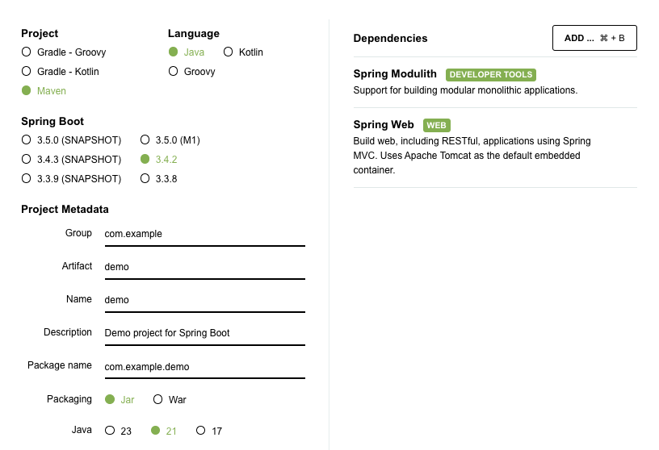
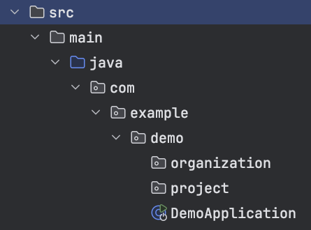
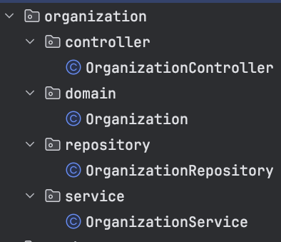

+++
date = '2025-01-24T00:01:01-06:00'
draft = false
title = 'Spring Modulith Part I: Up and Running'
summary = "What if you could work in a monolith project while making it easier in the future to pull out modules into their own services? What if you had a way to know that you've too tightly coupled components together? Enter Spring Modulith"
categories = ['tech']
tags = ['spring', 'spring-modulith', 'spring-boot']
keywords = ["spring", "spring-boot", "spring-modulith"]
[cover]
    image = 'cover.png'
+++
You're starting a brand new project. Maybe you think you're making the next big thing that needs to scale to millions of users. Maybe it's just a hobby project. The reality is, you never know what kind of scale you're eventually going to need until you get closer to needing it. So how do you decide whether to start out with a monolith or microservices?

What if you could work in a monolith project while making it easier in the future to pull out modules into their own services? What if you had a way to know that you've too tightly coupled components together? Enter [Spring Modulith](https://spring.io/projects/spring-modulith).

When I first started writing Spring applications (even before Spring Boot) I followed a more clean architecture; grouping like classes together.

```
□ Example
└─ □ src/main/java
   ├─ □ example
   │  └─ Application.java
   ├─ □ example.controller
   │  └─ OrganizationController.java
   │  └─ ProjectController.java  
   └─ □ example.repository
      └─ OrganizationRepository.java
      └─ ProjectRepository.java
```
For a really long time, this was a solid way to organize a project. If you're looking for a controller, service, etc, you know exactly where to go look. Even before microservices became popular, the industry started moving towards a more functional organization structure. Spring Modulith takes this approach.

The easiest way to get started is [start.spring.io](start.spring.io). I'm going to initialize a project with a few basic things.



After downloading and unzipping, I'm going to create an initial project structure.

- `Organization` - At the very top of my hierarchy, I want to manage Organizations. When user's sign up, they will need to create something that represents their Organization.
- `Project` - Users will be able to create projects under their Organization. 

So to start, those will be my two modules. After creating the two modules, we end up with a source structure like this:



The next thing we want to do is to go ahead and have a basic test that will ensure that our modules are not coupled. There should already be a `DemoApplicationTests` class. Go ahead and modify it with the following:

```java
@SpringBootTest
class DemoApplicationTests {

	@Test
	void contextLoads() {
		var modules = ApplicationModules.of(DemoApplication.class);
		modules.forEach(System.out::println);
		modules.verify();
	}
}
```

- `ApplicationModules` - This class is part of the Spring Modulith project. 
- `modules.forEach` - This is going to print out information about each of the modules that Spring Modulith detects.
- `modules.verify()` - A basic assertion that everything is passing. 

Right now the test should pass. But let's add a bit more code. Note that the way Spring Modulith detects modules is any package that is a peer to `DemoApplication.java`; which is the root module. So `organization` and `project` are each modules, according to Spring Modulith.



Don't worry about what is in those classes. They are just stubs for now to make this point. Spring Modulith looks at that code under the `organization` module (package) and verifies that it is decoupled from any other modules. If you run the test again, you should see some output like this:

```
# Organization
> Logical name: organization
> Base package: com.example.demo.organization
> Excluded packages: none
> Spring beans:
  o ….controller.OrganizationController
  o ….repository.OrganizationRepository
  o ….service.OrganizationService
```

Let's go ahead and stub out the `project` module in a similar way. When creating the `Project` domain, let's have it reference an `Organization`. Generally, that would make sense because projects would belong to organizations.

```java
public class Project {
	private UUID id;
	private String name;
	private Organization organization;
	
	// getters/setters omitted for brevity
}
```

Let's run our test again. We've got some new info about `Project`:

```
# Organization
> Logical name: organization
> Base package: com.example.demo.organization
> Excluded packages: none
> Spring beans:
  o ….controller.OrganizationController
  o ….repository.OrganizationRepository
  o ….service.OrganizationService

# Project
> Logical name: project
> Base package: com.example.demo.project
> Excluded packages: none
> Spring beans:
  o ….controller.ProjectController
  o ….repository.ProjectRepository
  o ….service.ProjectService
```

But now, our test is failing with:

```
org.springframework.modulith.core.Violations: - Module 'project' depends on non-exposed type com.example.demo.organization.domain.Organization within module 'organization'!
Field <com.example.demo.project.domain.Project.organization> has type <com.example.demo.organization.domain.Organization> in (Project.java:0)
```

You might be thinking to yourself, "but I want this to work". While I'd discourage it, we can make it work. Just move the `Organization` domain to the root of the `organization` package. The test will pass. The root of each module is open by default. Some say this is how you might share interfaces or http client code. I don't love this approach and in a future article I'll talk more about this.

Spring Modulith also supports `package-info` files to help manage how module visibility works. If you move the `Organization` domain back under the `domain` package and in the root of the `organization` package, create a `package-info.java` file with the following contents:

```java
@org.springframework.modulith.ApplicationModule(
		type = org.springframework.modulith.ApplicationModule.Type.OPEN
)
package com.example.demo.organization;
```

Run your test again, all should be happy, green, and passing. Now, as you flesh out more of your application flow and logic, when you run your tests, you'll know if you've broken any module boundaries. 

I'm going to stop here for this article. In the next article, I'll add a bit more meat like Spring Data and Docker Compose Support so we can begin to see something a bit more realistic and how we might be able to avoid the `Organization -> Project` hard wired coupling.


